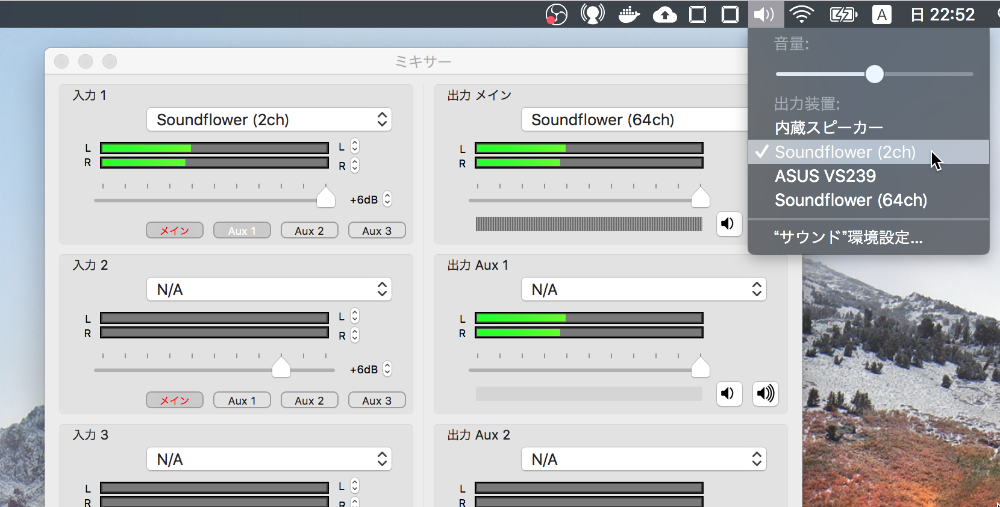
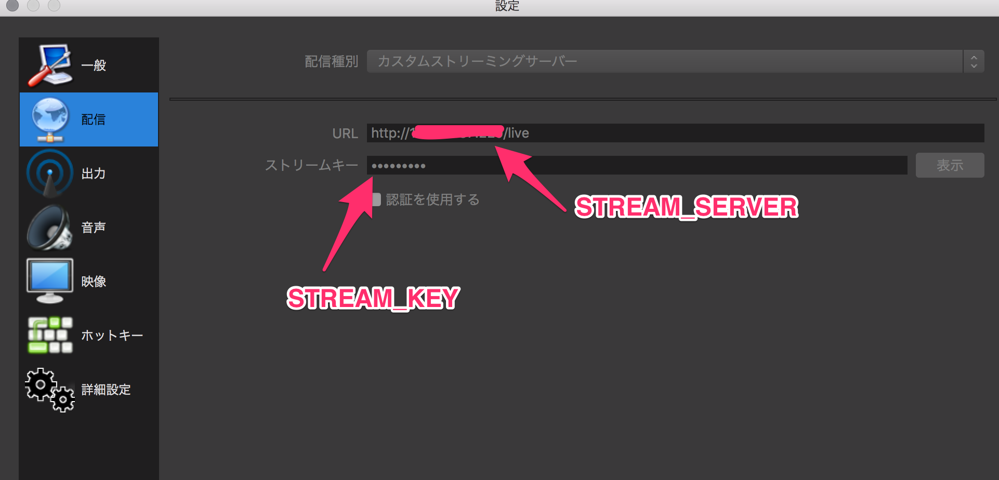
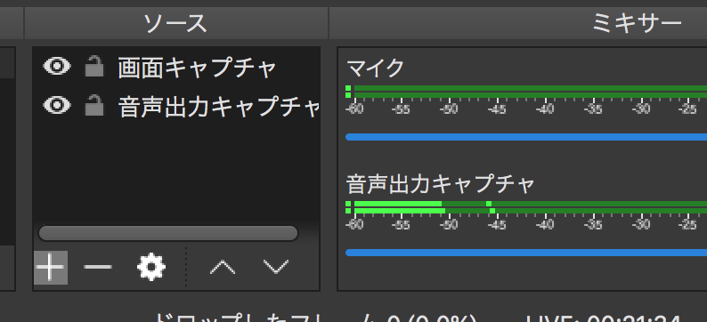

# docker hls server

## usage
require [Docker](https://www.docker.com/)

run server

```sh
export STREAM_SERVER=<server ip>:7000
export STREAM_KEY=<your key>
./build.sh
./run.sh
```

## live stream with Desktop video and audio on Mac

- require [soundflower](https://github.com/mattingalls/Soundflower/releases/)
- require [ladiocast](https://itunes.apple.com/jp/app/ladiocast/id411213048?mt=12)
- require [Open Broadcaster Software](https://obsproject.com/ja)

- install soundflower and ladiocast
  - [if you did not install soundflower](https://hawksnowlog.blogspot.com/2018/05/install-soundflower-into-high-sierra.html)
- setting ladiocast with following parameter



- setting on OBS



- setting sources



- enjoy your live cast!
